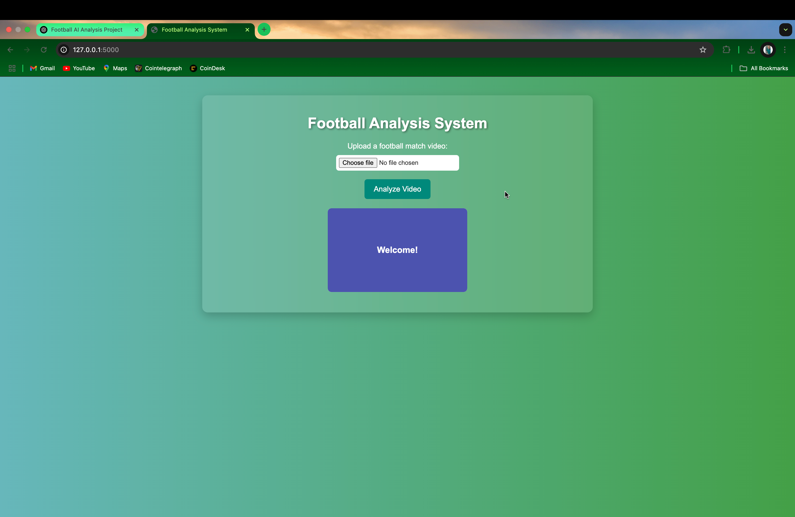

<h1 style="color: #2F4F4F; text-align:center;"><b>AI-Football-Analysis</b></h1>

<em>Real-time Football Analysis System using YOLO, OpenCV, and Python</em>

<h2 style="color:#4169E1;">1. Overview</h2>

This repository demonstrates an end-to-end system for analyzing football match videos. It performs <strong>object detection</strong> with YOLO to locate players, referees, and the ball; <strong>team assignment</strong> by clustering player shirt colors with KMeans; <strong>movement analysis</strong> using optical flow and perspective transformation to compute real-world distances and speeds; and <strong>LLM classification</strong> to summarize match events. An interactive Flask-based UI allows video upload, in-browser preview, screenshot capture, and download of the processed output.

<h2 style="color:#4169E1;">2. Project Structure</h2>
<pre>
AI-Football-Analysis/
├── app.py                    # Flask backend application
├── env1/                     # Virtual environment (optional)
├── models/                   # Pre-trained YOLO model weights (e.g., yolov5s.pt)
├── requirements.txt          # Python dependencies
├── static/
│   └── style.css             # CSS for UI styling (minimal/inline styling used in README)
├── templates/
│   ├── index.html            # Homepage for video upload
│   └── results.html          # Results page with video preview, download, and screenshot capture
├── football_utils/           # Modules for detection, tracking, team assignment, LLM inference, and video processing
│   ├── detection.py
│   ├── tracking.py
│   ├── team_assignment.py
│   ├── llm_inference.py
│   └── video_processing.py
├── uploads/                  # Uploaded videos
├── outputs/                  # Processed output videos
└── screenshots/              # Screenshots for README display
</pre>

<h2 style="color:#4169E1;">3. Installation</h2>
<ol>
  <li><strong>Clone this repository:</strong>
    <pre><code>git clone https://github.com/deephabiswashi/AI-Football-Analysis.git
cd AI-Football-Analysis</code></pre>
  </li>
  <li><strong>Create and activate a virtual environment (optional):</strong>
    <pre><code>python -m venv env1
source env1/bin/activate    # On Windows: env1\Scripts\activate</code></pre>
  </li>
  <li><strong>Install dependencies:</strong>
    <pre><code>pip install -r requirements.txt</code></pre>
  </li>
  <li><strong>Download YOLO Weights:</strong> Place your YOLO weights (e.g., <code>yolov5s.pt</code>) into the <code>models/</code> folder.</li>
</ol>

<h2 style="color:#4169E1;">4. Usage</h2>
<ol>
  <li><strong>Run the Flask app:</strong>
    <pre><code>python app.py</code></pre>
  </li>
  <li>Open your browser and navigate to <a href="http://127.0.0.1:5000" target="_blank">http://127.0.0.1:5000</a>.</li>
  <li>Upload a football match video using the interactive homepage.</li>
  <li>View analysis results:
    <ul>
      <li><strong>Video Preview:</strong> Watch the processed video directly in your browser.</li>
      <li><strong>Download Option:</strong> Download the processed video from the <code>outputs/</code> folder.</li>
      <li><strong>Screenshot Capture:</strong> Capture and optionally upload screenshots of key frames.</li>
    </ul>
  </li>
</ol>

<h2 style="color:#4169E1;">5. Screenshots</h2>

Below are example screenshots demonstrating various parts of the application. Ensure the images are stored in the <code>screenshots/</code> folder in the project root.

<ul>
  <li><strong>Homepage:</strong> </li>
  <li><strong>Results Page:</strong> </li>
  <li><strong>Input Video Sample 1:</strong> </li>
  <li><strong>Input Video Sample 2:</strong> </li>
  <li><strong>Input Video Sample 3:</strong> </li>
</ul>

<h2 style="color:#4169E1;">6. Video Demo</h2>

Watch the processed video demo by clicking the link below:

<ul>
  <li><a href="outputs/processed_video1.mp4" target="_blank">Processed Video Demo 1</a></li>
</ul>
<ul>
  <li><a href="outputs/processed_video2.mp4" target="_blank">Processed Video Demo 2</a></li>
</ul>
<ul>
  <li><a href="outputs/processed_video3.mp4" target="_blank">Processed Video Demo 3</a></li>
</ul>

<h2 style="color:#4169E1;">7. Contributing</h2>

Contributions are welcome! Please feel free to open issues or submit pull requests to enhance the detection pipeline, tracking, UI, or add new features.

<h2 style="color:#4169E1;">8. License</h2>

This project is licensed under the <strong>MIT License</strong>. See the <code>LICENSE</code> file for details.

<em>Made with ❤️ by &lt;Deep Habiswashi&gt;</em>

